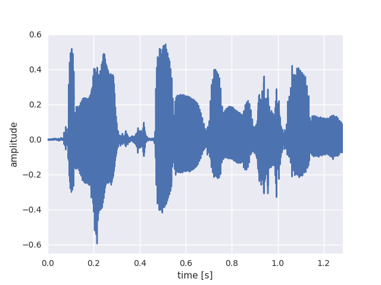
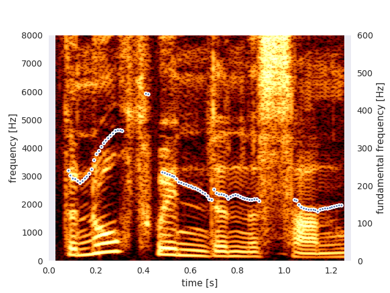

# Parselmouth - Praat in Python, the Pythonic way

[](https://pypi.org/project/praat-parselmouth/)
[](https://gitter.im/PraatParselmouth/Lobby)
[](https://github.com/YannickJadoul/Parselmouth/actions?query=workflow:CI+branch:stable)
[](https://parselmouth.readthedocs.io/en/latest/)
[](https://github.com/YannickJadoul/Parselmouth/blob/master/LICENSE)
[](https://mybinder.org/v2/gh/YannickJadoul/Parselmouth/master?urlpath=lab%2Ftree%2Fdocs%2Fexamples)

**Parselmouth** is a Python library for the [Praat](http://www.praat.org) software.

Though other attempts have been made at porting functionality from Praat to Python, Parselmouth is unique in its aim to provide a complete and Pythonic interface to the internal Praat code. While other projects either wrap Praat's scripting language or reimplementing parts of Praat's functionality in Python, Parselmouth directly accesses Praat's C/C++ code (which means the algorithms and their output are exactly the same as in Praat) and provides efficient access to the program's data, but *also* provides an interface that looks no different from any other Python library.

Drop by our [Gitter chat room](https://gitter.im/PraatParselmouth/Lobby) or post a message to our [Google discussion group](https://groups.google.com/d/forum/parselmouth) if you have any question, remarks, or requests!

*Try out* Parselmouth online, in interactive Jupyter notebooks on [Binder](https://mybinder.org/v2/gh/YannickJadoul/Parselmouth/master?urlpath=lab%2Ftree%2Fdocs%2Fexamples).

**Warning**: Parselmouth 0.4.0 is the *last version* supporting Python 2. Python 2 has reached End Of Life on January 1, 2020, and is officially not supported anymore: see https://python3statement.org/. Please [move to Python 3](https://docs.python.org/3/howto/pyporting.html), to be able to keep using new Parselmouth functionality.

## Installation
Parselmouth can be installed like any other Python library, using (a recent version of) the Python package manager `pip`, on Linux, macOS, and Windows:
```
pip install praat-parselmouth
```
or, to update your installed version to the latest release:
```
pip install -U praat-parselmouth
```

For more detailed instructions, please refer to the [documentation](https://parselmouth.readthedocs.io/en/stable/installation.html).

## Example usage
```Python
import parselmouth

import numpy as np
import matplotlib.pyplot as plt
import seaborn as sns

sns.set() # Use seaborn's default style to make attractive graphs

# Plot nice figures using Python's "standard" matplotlib library
snd = parselmouth.Sound("docs/examples/audio/the_north_wind_and_the_sun.wav")
plt.figure()
plt.plot(snd.xs(), snd.values.T)
plt.xlim([snd.xmin, snd.xmax])
plt.xlabel("time [s]")
plt.ylabel("amplitude")
plt.show() # or plt.savefig("sound.png"), or plt.savefig("sound.pdf")
```

```Python
def draw_spectrogram(spectrogram, dynamic_range=70):
    X, Y = spectrogram.x_grid(), spectrogram.y_grid()
    sg_db = 10 * np.log10(spectrogram.values)
    plt.pcolormesh(X, Y, sg_db, vmin=sg_db.max() - dynamic_range, cmap='afmhot')
    plt.ylim([spectrogram.ymin, spectrogram.ymax])
    plt.xlabel("time [s]")
    plt.ylabel("frequency [Hz]")

def draw_intensity(intensity):
    plt.plot(intensity.xs(), intensity.values.T, linewidth=3, color='w')
    plt.plot(intensity.xs(), intensity.values.T, linewidth=1)
    plt.grid(False)
    plt.ylim(0)
    plt.ylabel("intensity [dB]")

intensity = snd.to_intensity()
spectrogram = snd.to_spectrogram()
plt.figure()
draw_spectrogram(spectrogram)
plt.twinx()
draw_intensity(intensity)
plt.xlim([snd.xmin, snd.xmax])
plt.show() # or plt.savefig("spectrogram.pdf")
```

```Python
def draw_pitch(pitch):
    # Extract selected pitch contour, and
    # replace unvoiced samples by NaN to not plot
    pitch_values = pitch.selected_array['frequency']
    pitch_values[pitch_values==0] = np.nan
    plt.plot(pitch.xs(), pitch_values, 'o', markersize=5, color='w')
    plt.plot(pitch.xs(), pitch_values, 'o', markersize=2)
    plt.grid(False)
    plt.ylim(0, pitch.ceiling)
    plt.ylabel("fundamental frequency [Hz]")

pitch = snd.to_pitch()
# If desired, pre-emphasize the sound fragment before calculating the spectrogram
pre_emphasized_snd = snd.copy()
pre_emphasized_snd.pre_emphasize()
spectrogram = pre_emphasized_snd.to_spectrogram(window_length=0.03, maximum_frequency=8000)
plt.figure()
draw_spectrogram(spectrogram)
plt.twinx()
draw_pitch(pitch)
plt.xlim([snd.xmin, snd.xmax])
plt.show() # or plt.savefig("spectrogram_0.03.pdf")
```

```Python
# Find all .wav files in a directory, pre-emphasize and save as new .wav and .aiff file
import parselmouth

import glob
import os.path

for wave_file in glob.glob("audio/*.wav"):
    print("Processing {}...".format(wave_file))
    s = parselmouth.Sound(wave_file)
    s.pre_emphasize()
    s.save(os.path.splitext(wave_file)[0] + "_pre.wav", 'WAV') # or parselmouth.SoundFileFormat.WAV instead of 'WAV'
    s.save(os.path.splitext(wave_file)[0] + "_pre.aiff", 'AIFF')
```

More examples of different use cases of Parselmouth can be found in the [documentation's examples section](https://parselmouth.readthedocs.io/en/stable/examples.html).

## Documentation
Documentation is available at [ReadTheDocs](http://parselmouth.readthedocs.io/), including the API reference of Parselmouth.

## Development
Currently, the actual project and Parselmouth's code is not very well documented. Or well, hardly documented at all. That is planned to still change in order to allow for easier contribution to this open source project.
Until that day in some undefined future, if you want to contribute to Parselmouth, do let me know [on Gitter](https://gitter.im/PraatParselmouth/Development) or [by email](mailto:Yannick.Jadoul@ai.vub.ac.be), and I will very gladly guide you through the project and help you get started.

Briefly summarized, Parselmouth is built using [`cmake`](https://cmake.org/). Next to that, to manually build Parselmouth, the only requirement is a modern C++ compiler supporting the C++17 standard.

## Acknowledgements
- Parselmouth builds on the extensive code base of [Praat](https://github.com/praat/praat) by Paul Boersma, which actually implements the huge variety of speech processing and phonetic algorithms that can now be accessed through Parselmouth.
- In order to do so, Parselmouth makes use of the amazing [pybind11](https://github.com/pybind/pybind11) library, allowing to expose the C/C++ functionality of Praat as a Python interface.
- Special thanks go to [Bill Thompson](https://billdthompson.github.io/) and [Robin Jadoul](https://github.com/RobinJadoul/) for their non-visible-in-history but very valuable contributions.

## License
* Parselmouth is released under the GNU General Public License, version 3 or later. See [the `LICENSE` file](LICENSE) for details.

  A [manuscript introducing Parselmouth](https://ai.vub.ac.be/~yajadoul/jadoul_introducing-parselmouth_a-python-interface-to-praat.pdf) (and [supplementary material](https://ai.vub.ac.be/~yajadoul/jadoul_introducing-parselmouth_a-python-interface-to-praat_supplementary-material.zip)) has been [published in the Journal of Phonetics](https://www.sciencedirect.com/science/article/abs/pii/S0095447017301389). Scientific research using Parselmouth's functionality can [*cite Parselmouth*](https://parselmouth.readthedocs.io/en/stable/#citing-parselmouth) as follows:
  
  > Jadoul, Y., Thompson, B., & de Boer, B. (2018). Introducing Parselmouth: A Python interface to Praat. *Journal of Phonetics*, *71*, 1-15. https://doi.org/10.1016/j.wocn.2018.07.001

* [Praat](https://github.com/praat/praat) is released under [the GNU General Public License, version 2 or later](praat/main/GNU_General_Public_License.txt). Small changes to this code base, made in the context of Parselmouth, can be found within the `git` history.

  Parselmouth only exposes Praat's existing functionality and implementation of algorithms. If you use Parselmouth in your research and plan to cite it in a scientific publication, please do not forget to [*cite Praat*](https://www.fon.hum.uva.nl/praat/manual/FAQ__How_to_cite_Praat.html).

  > Boersma, P., & Weenink, D. (2021). Praat: doing phonetics by computer [Computer program]. Version 6.1.38, retrieved 2 January 2021 from [http://www.praat.org/](http://www.praat.org/)

* [pybind11](https://github.com/pybind/pybind11) is released under [a BSD-style license](pybind11/LICENSE).

* The audio fragment extracted from a recording of the Aesop fable *The North Wind and the Sun*, used as example audio in the documentation and tests, is a [Wikimedia Commons audio file](https://en.wikipedia.org/wiki/File:Recording_of_speaker_of_British_English_(Received_Pronunciation).ogg) licensed by the International Phonetic Association under the [Creative Commons Attribution-Share Alike 3.0 Unported license](https://creativecommons.org/licenses/by-sa/3.0/deed.en).
