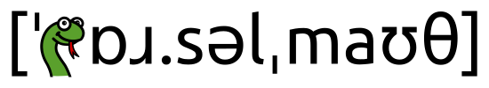

Parselmouth -- Praat in Python, the Pythonic way
================================================

**Parselmouth** is a Python library for the `Praat <http://www.praat.org>`_ software.

Though other attempts have been made at porting functionality from Praat to Python, Parselmouth is unique in its aim to provide a complete and Pythonic interface to the internal Praat code. While other projects either wrap Praat's scripting language or reimplementing parts of Praat's functionality in Python, Parselmouth directly accesses Praat's C/C++ code (which means the algorithms and their output are exactly the same as in Praat) and provides efficient access to the program's data, but *also* provides an interface that looks no different from any other Python library.

Please note that Parselmouth is currently in premature state and in active development. While the amount of functionality that is currently present is not huge, more will be added over the next few months. As such, *feedback* and possibly *contributions* are highly appreciated.

Drop by our `Gitter chat room <https://gitter.im/PraatParselmouth/Lobby>`_ or post a message to our `Google discussion group <https://groups.google.com/d/forum/parselmouth>`_ if you have any question, remarks, or requests!

.. warning::

    Parselmouth 0.4.0 is the *last version* supporting Python 2. Python 2 has reached End Of Life on January 1, 2020, and is officially not supported anymore: see https://python3statement.org/. Please `move to Python 3 <https://docs.python.org/3/howto/pyporting.html>`_, to be able to keep using new Parselmouth functionality.

.. only:: html

    .. note::

        Try out Parselmouth online, in interactive Jupyter notebooks on Binder: |binder_badge_examples|

.. toctree::
    :maxdepth: 2
    :caption: Getting Started

    installation
    examples

    api_reference

Citing Parselmouth
------------------

A `manuscript introducing Parselmouth <https://ai.vub.ac.be/~yajadoul/jadoul_introducing-parselmouth_a-python-interface-to-praat.pdf>`_ (and `supplementary material <https://ai.vub.ac.be/~yajadoul/jadoul_introducing-parselmouth_a-python-interface-to-praat_supplementary-material.zip>`_) has been `published in the Journal of Phonetics <https://www.sciencedirect.com/science/article/abs/pii/S0095447017301389>`_. Scientific work and publications can for now cite Parselmouth in the following way:

    Jadoul, Y., Thompson, B., & de Boer, B. (2018). Introducing Parselmouth: A Python interface to Praat. *Journal of Phonetics*, *71*, 1-15. https://doi.org/10.1016/j.wocn.2018.07.001

.. code-block:: bibtex

    @article{parselmouth,
        author = "Yannick Jadoul and Bill Thompson and Bart de Boer",
        title = "Introducing {P}arselmouth: A {P}ython interface to {P}raat",
        journal = "Journal of Phonetics",
        volume = "71",
        pages = "1--15",
        year = "2018",
        doi = "https://doi.org/10.1016/j.wocn.2018.07.001"
    }

Since Parselmouth exposes existing Praat functionality and algorithm implementations, we suggest also `citing Praat <https://www.fon.hum.uva.nl/praat/manual/FAQ__How_to_cite_Praat.html>`_ when using Parselmouth in scientific research:

    Boersma, P., & Weenink, D. (2021). Praat: doing phonetics by computer [Computer program]. Version 6.1.38, retrieved 2 January 2021 from http://www.praat.org/

.. code-block:: bibtex

    @misc{praat,
        author = "Paul Boersma and David Weenink",
        title = "{P}raat: doing phonetics by computer [{C}omputer program]",
        howpublished = "Version 6.1.38, retrieved 2 January 2021 \url{http://www.praat.org/}",
        year = "2021"
    }

Indices and tables
==================

* :ref:`genindex`
* :ref:`modindex`
* :ref:`search`
